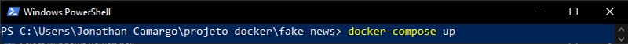
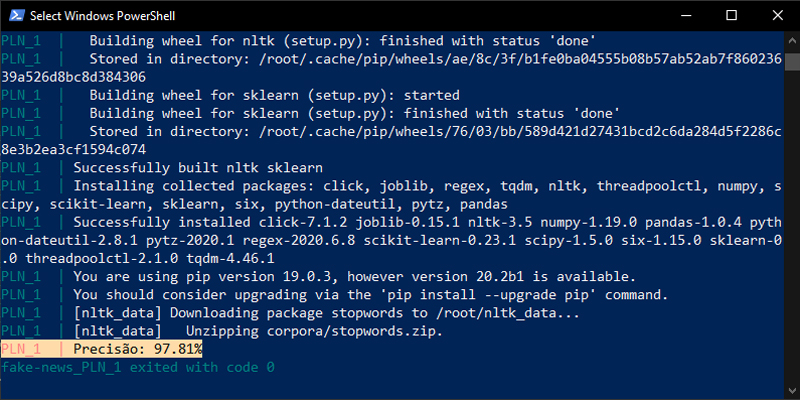

<h1>Identificação de Fake News com classificação de texto</h1>
<h3>Contexto</h3>

A democratização da internet trouxe à tona características como a produção de informação desenfreada. Ambientes virtuais como redes sociais tornaram-se prósperos à disseminação de notícias falsas devido a facilidade de compartilhamento de informação e dificuldade em identificar a veracidade de um grande volume de dados.

<h3>Experimento</h3>

Esta aplicação é um experimento para trabalhar com técnicas de classificação de texto vinculada à outras atividades acadêmicas, como o próprio projeto de mestrado.

O conceito de conteinerização em Docker contribui para pensar futuros algoritmos de maior complexidade e utilizar este experimento como uma parte modular deste projeto.

<h3>Conjunto de dados</h3>

Para esta aplicação, foi utilizado o dataset <a href="https://github.com/ViniciusNunes0/SIRENE-news">SIRENE-news</a> composto por 4.742 notícias.

<h3>Pré-requisitos</h3>

É necessário ter a plataforma <a href="https://www.docker.com/products/docker-desktop" target="_blank" rel="noopener noreferrer">Docker</a> instalada em sua máquina.

<h3>Bibliotecas Instaladas</h3>

nltk - tokenização e remoção de stopwords

scikit-learn - vetorização de palavras, treinamento do algoritmo e importação do classificador

pandas - criação de dataframe para a leitura do dataset 

<h3>Como Utilizar</h3>

1. Abrir um shell de comando

2. Acessar a pasta raíz da aplicação

3. Executar o comando: docker-compose up

4. O resultado da precisão será emitido

<h3>Resultados e Discussão</h3>

Utilizando o classificador Random Forest, foi possível obter uma precisão de 97.81% na classificação de notícias entre falsas e verdadeiras. Serão incorporadas mais técnicas de Processamento de Linguagem Natural ao código Python, este código servirá como um módulo para incorporar um algoritmo classificador mais robusto.

<h3>Observação</h3>

A proposta de exibir a variável "Precisão" na página em HTML não foi concretizada

 

   

 

